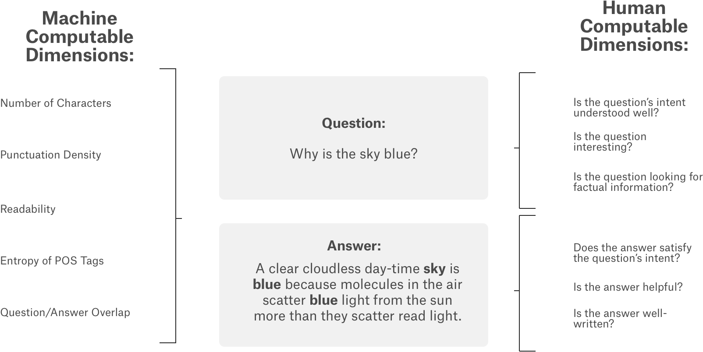

# Google Quest Q&A Labelling Challenge

Computers are really good at answering questions with single, verifiable answers. But, humans are often still better at answering questions about opinions, recommendations, or personal experiences.

Humans are better at addressing subjective questions that require a deeper, multidimensional understanding of context - something computers aren't trained to do well…yet.. Questions can take many forms - some have multi-sentence elaborations, others may be simple curiosity or a fully developed problem. They can have multiple intents, or seek advice and opinions. Some may be helpful and others interesting. Some are simple right or wrong.

Unfortunately, it’s hard to build better subjective question-answering algorithms because of a lack of data and predictive models. That’s why the CrowdSource team at Google Research, a group dedicated to advancing NLP and other types of ML science via crowdsourcing, has collected data on a number of these quality scoring aspects.

In this competition, you’re challenged to use this new dataset to build predictive algorithms for different subjective aspects of question-answering. The question-answer pairs were gathered from nearly 70 different websites, in a "common-sense" fashion. Our raters received minimal guidance and training, and relied largely on their subjective interpretation of the prompts. As such, each prompt was crafted in the most intuitive fashion so that raters could simply use their common-sense to complete the task. By lessening our dependency on complicated and opaque rating guidelines, we hope to increase the re-use value of this data set. What you see is what you get!

Demonstrating these subjective labels can be predicted reliably can shine a new light on this research area. Results from this competition will inform the way future intelligent Q&A systems will get built, hopefully contributing to them becoming more human-like.

## About

This is an competition hosted on Kaggle. View the challenge [page](https://www.kaggle.com/c/google-quest-challenge/overview) for more details.

## Dataset

The data for this competition includes questions and answers from various StackExchange properties. Your task is to predict target values of 30 labels for each question-answer pair.

The list of 30 target labels are the same as the column names in the sample_submission.csv file. Target labels with the prefix question_ relate to the question_title and/or question_body features in the data. Target labels with the prefix answer_ relate to the answer feature.

Each row contains a single question and a single answer to that question, along with additional features. The training data contains rows with some duplicated questions (but with different answers). The test data does not contain any duplicated questions.

This is not a binary prediction challenge. Target labels are aggregated from multiple raters, and can have continuous values in the range [0,1]. Therefore, predictions must also be in that range.

Since this is a synchronous re-run competition, you only have access to the Public test set. For planning purposes, the re-run test set is no larger than 10,000 rows, and less than 8 Mb uncompressed.

Additional information about the labels and collection method will be provided by the competition sponsor in the forum.

Please find the dataset [here](https://www.kaggle.com/c/google-quest-challenge/data)

## Evaluation metric
[Spearman's correlation coefficient](https://en.wikipedia.org/wiki/Spearman%27s_rank_correlation_coefficient)

## Results
All individual models had a Spearman score in range 0.454-0.471. Our final solution had a Spearman score of 0.42430 and 10th/1571 rank on private leaderboard.